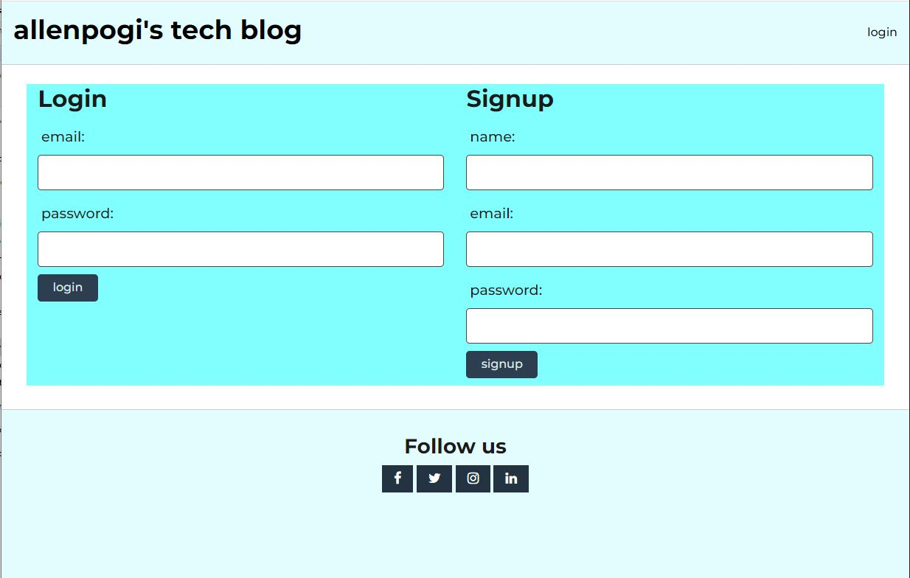

# tech-blog

## Description

This program is a blog application where any user can create a topic and other users can comment on the topic.

## Table of Contents
- [Installation](#installation)
- [Usage](#usage)
- [Screenshot](#screenshot)
- [Video recording](#video-recording)
- [Credits](#credits)
- [License](#license)
- [Badges](#badges)
- [Features](#features)
- [Contributing](#contributing)
- [Tests](#tests)
- [Email address](#email-address)
- [Github username](#github-username)

## Installation
Run npm install to install the dependencies.
Run the schema.sql file in db folder to initialise the ecommerce_db.
Run the index.js under the seeds folder to create the tables and seed the tables with data.
Then run "npm start" to run the application.

## Usage
This program is deployed on heroku and can be accessed using this URL:

## Screenshot

Below are some screenshots:

## Video recording

There is no video recording.

## Credits
none

## License
n/a

## Badges

## Features
The following are the functions of the program:
- login
- sign up
- view the homepage which will list all topics
- open a topic and view comments
- post a comment on a topic
- go to profile page to view the topics created by the user
- create a new topic
- edit a topic
- delete a topic

## Contributing
n/a

## Tests
N/A

## Email address
allen.tuazon@gmail.com

## Github username
allentpogi